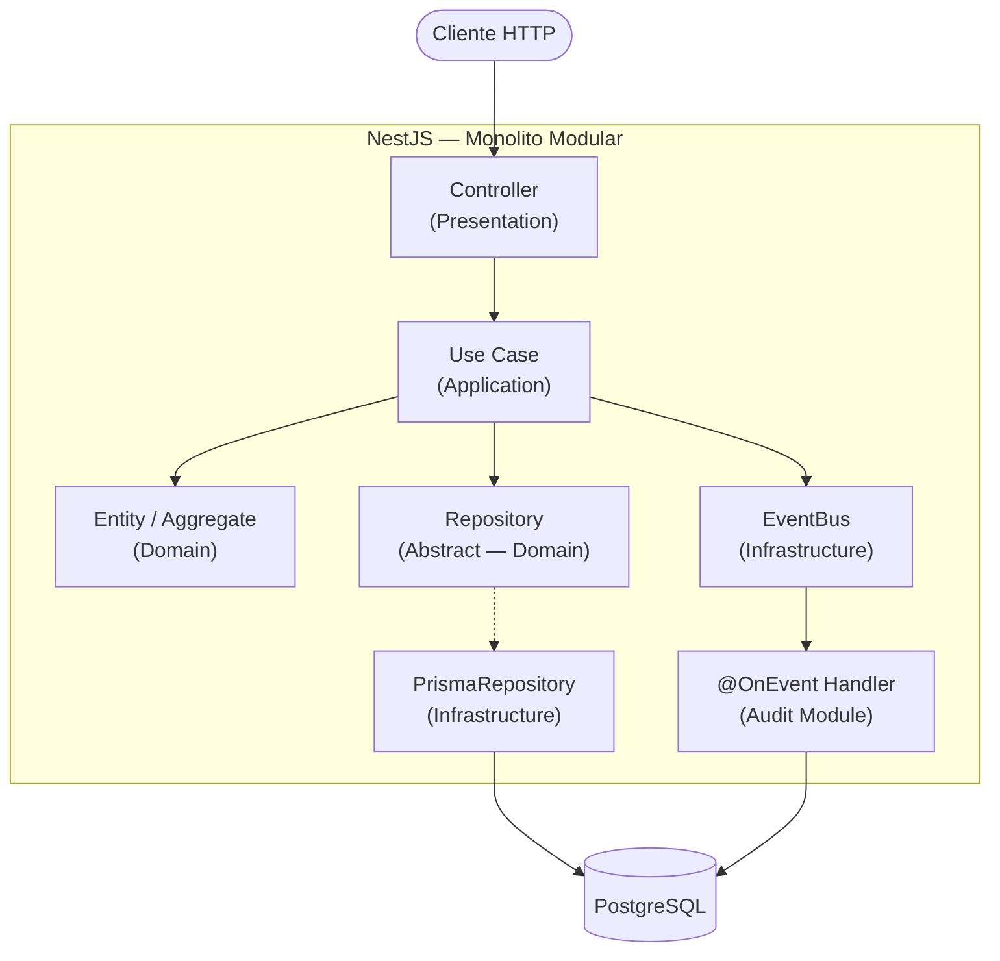
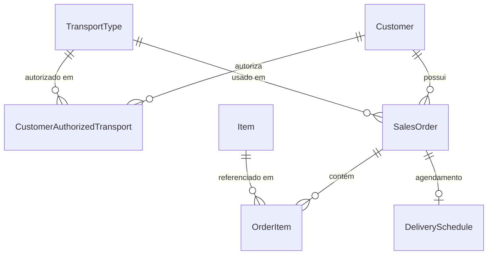
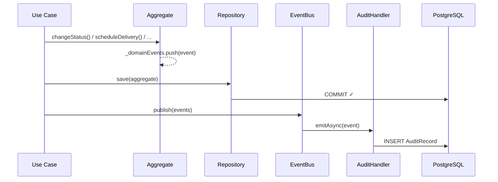

# OVGS — Sistema de Gestão de Ordens de Venda

API REST com NestJS, Clean Architecture e DDD para gerenciar o ciclo de vida de ordens de venda com trilha de auditoria orientada a eventos.

---

## Índice

- [Visão Geral](#visão-geral)
- [Como Executar](#como-executar)
- [Cobertura de Requisitos](#cobertura-de-requisitos)
- [Arquitetura](#arquitetura)
- [Modelagem de Domínio](#modelagem-de-domínio)
- [Persistência](#persistência)
- [Escalabilidade e Performance](#escalabilidade-e-performance)
- [Trade-offs](#trade-offs)
- [Diferenciais](#diferenciais)
- [API Reference](#api-reference)
- [Tecnologias](#tecnologias)

---

## Visão Geral

O OVGS centraliza o gerenciamento de ordens de venda (OV) numa única plataforma. Cada OV percorre uma máquina de estados explícita, e toda operação que altera estado emite um evento de domínio persistido como trilha de auditoria imutável.

```
CRIADA → PLANEJADA → AGENDADA → EM_TRANSPORTE → ENTREGUE
```

---

## Como Executar

### Local

```bash
npm install
cp .env.example .env
docker compose up db -d
npm run db:migrate && npm run db:seed
npm run start:dev
```

### Docker Compose

```bash
docker compose up --build
```

> Migrações aplicadas automaticamente no startup da imagem de produção.

| | URL |
|---|---|
| API | `http://localhost:3000` |
| Swagger | `http://localhost:3000/api` |

### Testes

```bash
npm run test:unit          # 42 testes unitários
npm run test:integration   # 10 testes de integração (requer Docker)
npm run test:cov           # cobertura
```

---

## Cobertura de Requisitos

| Requisito | Status | Observação |
|---|---|---|
| Customer CRUD | ✅ | `POST /customers`, `GET`, `PATCH` + autorização de transporte |
| Transport Type CRUD | ✅ | `POST /transport-types`, `GET`, `PATCH` |
| Item CRUD | ✅ | `POST /items`, `GET` |
| Sales Order Management | ✅ | Criação com validação de cliente, transporte e itens |
| State Machine | ✅ | Transições validadas na entidade; exceção de domínio em transições inválidas |
| Agendamento de entrega | ✅ | Schedule, reschedule e confirm com regras de estado |
| Trilha de auditoria | ✅ | 5 eventos mapeados com `previousState` e `newState` em JSON |
| Docker Compose | ✅ | Multi-stage build; ~350 MB |
| Testes unitários | ✅ | 42 testes — domínio + use cases com repositórios mockados |
| Testes de integração | ✅ | 10 testes com PostgreSQL real via Testcontainers |
| Swagger / OpenAPI | ✅ | Exemplos em todos os endpoints POST/PATCH |

---

## Arquitetura



Cada módulo (`sales-order`, `customer`, `item`, `transport-type`, `audit`) segue a mesma estrutura interna:

```
presentation → application → domain ← infrastructure
```

O domínio não conhece NestJS nem Prisma. Contratos de repositório são `abstract class` — não `interface` — por limitação do sistema de DI do NestJS.

### Monolito Modular

Escolha intencional: fronteiras de domínio ainda em maturação, time pequeno, overhead operacional de microsserviços não justificado. Cada módulo já é um bounded context isolado — a extração para microsserviços seria uma mudança de infraestrutura (trocar `EventEmitter2` por Kafka/RabbitMQ), não de domínio.

| Aspecto | Monolito Modular | Microsserviços |
|---|---|---|
| Complexidade operacional | Baixa | Alta — service mesh, múltiplos deploys |
| Consistência de dados | ACID nativo | Consistência eventual, Sagas |
| Escalabilidade | Horizontal (stateless) | Independente por contexto |
| Fronteiras de domínio | Flexíveis | Custosas de mudar após separação |

---

## Modelagem de Domínio



- **Agregado principal**: `SalesOrder` encapsula `OrderItem[]` e `DeliverySchedule`. Acesso sempre pela raiz.
- **Rich Domain Model**: máquina de estados, validação de transições, regras de agendamento e autorização de transporte são métodos da entidade — não do use case.
- **Value Objects**: `OrderNumber` (`OV-YYYYMMDD-XXXXX`) e `DeliveryWindow` (invariante `startTime < endTime`).
- **Domain Events**: coletados no agregado (`_domainEvents[]`) e publicados pelo use case após o `save()`.

---

## Persistência

Prisma 7 com PostgreSQL. Cada agregado tem um mapper estático que converte entre o tipo Prisma e a entidade de domínio — Prisma não aparece nas camadas de domínio ou aplicação.

O `save()` da `SalesOrder` executa em transação única: upsert da ordem + delete/recreate dos itens + upsert do agendamento.

**Por que relacional?** FKs obrigatórias entre OV, cliente e transporte; transações ACID no save do agregado; filtros ad-hoc sobre múltiplas dimensões. `AuditRecord` seria candidato a document store (esquema variável por evento), mas o desacoplamento via eventos já permite essa migração sem tocar no domínio.

### Fluxo de auditoria



> `emitAsync` garante que erros nos handlers de auditoria não sejam silenciados. Trade-off: duas transações independentes — se a auditoria falhar após o save do agregado, o dado de negócio já foi persistido.
>
> Em um cenário com serviço externo de auditoria (fila Kafka/RabbitMQ), o padrão **Transactional Outbox** eliminaria esse risco: o evento seria salvo na mesma transação do agregado em uma tabela `outbox`, e um worker dedicado faria a publicação na fila garantindo entrega. Dentro do monolito com `EventEmitter2` in-process, o overhead do Outbox não se justifica.

---

## Escalabilidade e Performance

A aplicação é **stateless** — escala horizontal sem mudança de código. Em alta demanda:

- **Aplicação**: múltiplas instâncias atrás de load balancer, ou extração de bounded contexts como microsserviços
- **Banco**: read replicas para `GET /sales-orders` e `GET /audit`, que não exigem consistência imediata

| Mecanismo | Decisão |
|---|---|
| Índices | `AuditRecord.entityId`, `entityType`, `occurredAt` |
| Filtros | `where` dinâmico no Prisma — processado no banco, não na aplicação |
| Conexões | `pg.Pool` com reutilização de conexões |
| Logging | `pino` não bloqueante; arquivo em produção, sem passar pelo stdout |

---

## Trade-offs

| Decisão | Escolhido | Alternativa e motivo |
|---|---|---|
| Topologia | Monolito modular | Microsserviços — overhead não justificado no estágio atual |
| Auditoria | Dual-write via event bus | Transactional Outbox — garante consistência entre negócio e auditoria |
| Banco do domínio | PostgreSQL | NoSQL — FKs, ACID e filtros ad-hoc justificam o relacional |
| Banco de auditoria | PostgreSQL + coluna `Json` | Document store — esquema variável por evento seria mais natural |
| Repositórios | `abstract class` | `interface` — NestJS DI usa construtores como tokens |
| Eventos | `emitAsync` | `emit` fire-and-forget — `emitAsync` garante que erros nos handlers não são silenciados |

---

## Diferenciais

| Diferencial | Status | Detalhe |
|---|---|---|
| OpenAPI / Swagger | ✅ | `/api` com exemplos em todos os endpoints POST/PATCH |
| Clean Architecture | ✅ | 4 camadas por módulo com dependências unidirecionais |
| Arquitetura orientada a eventos | ✅ | Domain events com `emitAsync`, handlers `@OnEvent` |
| Logging estruturado | ✅ | `nestjs-pino`: JSON em produção, `pino-pretty` em dev, arquivo em `logs/` |
| Testes adicionais | ✅ | 42 unitários + 10 integração com banco real (Testcontainers) |
| Otimização de queries | ✅ parcial | Índices no `AuditRecord`, filtros dinâmicos, pool de conexões |
| Observabilidade | ❌ | OpenTelemetry + Prometheus/Grafana |
| Cache | ❌ | Candidatos: `GET /transport-types` e `GET /items` (baixa volatilidade) |
| CI/CD | ✅ | GitHub Actions: unit tests → integration tests em jobs sequenciais |
| Segurança / Auth | ❌ | Fora do escopo explícito do desafio; JWT + guards NestJS |

---

## API Reference

Documentação completa no Swagger em `/api`.

| Método | Rota | Descrição |
|---|---|---|
| `POST` | `/customers` | Criar cliente |
| `GET` | `/customers` | Listar clientes |
| `GET` | `/customers/:id` | Buscar cliente |
| `PATCH` | `/customers/:id` | Atualizar cliente |
| `POST` | `/customers/:id/transport-types/:transportTypeId` | Autorizar tipo de transporte |
| `POST` | `/transport-types` | Criar tipo de transporte |
| `GET` | `/transport-types` | Listar / buscar |
| `PATCH` | `/transport-types/:id` | Atualizar |
| `POST` | `/items` | Criar item |
| `GET` | `/items` | Listar / buscar |
| `POST` | `/sales-orders` | Criar ordem |
| `GET` | `/sales-orders` | Listar (filtros: `status`, `customerId`, `transportTypeId`, `date`) |
| `GET` | `/sales-orders/:id` | Buscar ordem |
| `PATCH` | `/sales-orders/:id/status` | Avançar status |
| `POST` | `/sales-orders/:id/schedule` | Agendar entrega |
| `PATCH` | `/sales-orders/:id/schedule` | Reagendar |
| `POST` | `/sales-orders/:id/schedule/confirm` | Confirmar agendamento |
| `GET` | `/audit` | Consultar trilha de auditoria |

---

## Tecnologias

| Tecnologia | Função |
|---|---|
| NestJS 11 | Framework web + DI container |
| TypeScript 5 (strict) | Tipagem estática |
| Prisma 7 | ORM + migrações |
| PostgreSQL 16 | Banco de dados |
| @nestjs/event-emitter | Despacho de eventos de domínio |
| nestjs-pino | Logging estruturado |
| class-validator | Validação de DTOs |
| @nestjs/swagger | OpenAPI |
| Jest + Testcontainers | Testes unitários e integração |
| Docker Compose | Ambiente local |
